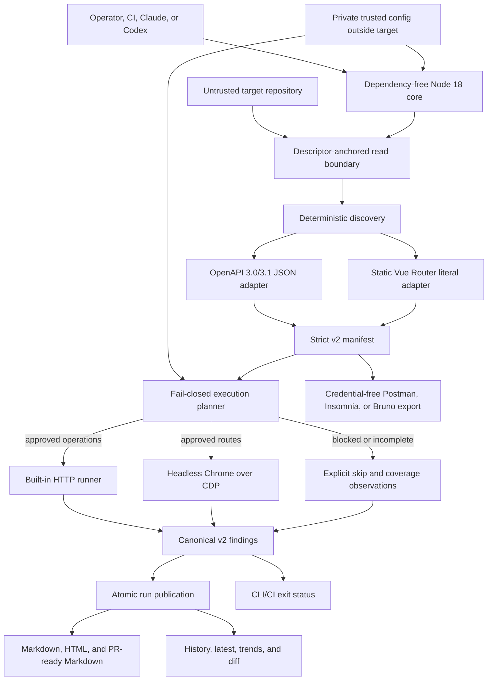

# Sentinel Architecture

**Architecture version:** 2.0 candidate  
**Status:** implementation in progress; final end-to-end, packaging, CI, and release verification pending  
**Decision record:** [ADR 0001](docs/adr/0001-deterministic-trusted-core.md)

## Goal

Sentinel answers one bounded question:

> Given a trusted operator configuration, an untrusted target repository, and a
> running development or test application, can Sentinel safely discover the
> supported API and browser surface, exercise the actions its policy authorizes,
> and publish reproducible findings without leaking credentials or disguising
> coverage gaps as success?

Sentinel is a QA orchestration layer. It is not a penetration test, a proof that an
application is defect-free, or a replacement for unit, integration, accessibility,
security, and framework-native tests.

## System flow



The Claude plugin and Codex command are thin hosts. Safety decisions, discovery,
transport, validation, redaction, and publication live in the same core. Target
content is data; it never becomes a host instruction or permission grant.

## Trust boundaries

| Input or component | Trust classification | Permitted authority |
|---|---|---|
| Bundled runtime, schemas, and defaults | Trusted release assets | Define contracts, limits, and default-deny behavior |
| Operator config outside the target | Trusted only after canonical-path, ownership, mode, identity, and schema checks | Approve exact origins, role secret references, discovery files, parameter examples, and mutation conditions |
| Target source and imported contracts | Untrusted | Supply discovery evidence and provenance only |
| Existing manifests, pages, responses, redirects, and report files | Untrusted | Supply observations only; revalidated before use |
| Environment secret values | Sensitive transient data | Resolved only inside core memory for redaction, setup availability, and pre-I/O planned-role capture; never serialized by design |
| LLM host | Orchestrator and explainer | Invoke the core and interpret results; cannot override core policy |

Trusted configuration is required explicitly with `--config`. It must be outside the
target repository, owned by the current user, private, and reachable through a
trusted canonical ancestor chain. It stores references such as
`env:SENTINEL_ADMIN_TOKEN`, not token values. `reportDir` is a canonical relative
path beneath the target; the core appends `sentinel-v2` unless already present.

During command initialization, the core resolves currently available configured
secrets to build its redactor. At execution, each selected API or browser engine
synchronously captures only the planned-role credentials before that engine begins
application I/O; it does not resolve a token separately for every request. Values
stay inside core memory and are redacted before validation and persistence. `setup`
also resolves role references only to report current availability and makes no
application requests. Chrome receives a fixed minimal environment with run-scoped
`HOME`, `XDG_CONFIG_HOME`, and `TMPDIR` directories (`XDG_CACHE_HOME` is isolated as
well), so bearer-token environment variables are not inherited by the browser
process.

Sentinel 2.0 accepts zero or one canonical approved origin and zero or one configured
service per invocation. Discovery subjects do not carry an independently proven
service binding, so accepting multiple origins would make transport authority
ambiguous. Equivalent origin spellings are canonicalized and deduplicated; distinct
origins or multiple services fail with `CONFIG_MULTI_SERVICE_UNSUPPORTED`. A
zero-origin config can discover and report readiness but cannot authorize executable
work; API/browser execution requires exactly one. A configured service must bind to
that sole approved origin, so a zero-origin config has no service entry. A
multi-service repository is tested with one separately trusted invocation per service.

## Supported execution matrix

Sentinel 2.0 makes a complete-execution claim only for this matrix:

| Surface | Supported form | What makes coverage partial or unsupported |
|---|---|---|
| Backend discovery | OpenAPI 3.0.x or 3.1.x JSON; literal relative paths; local `#/components/schemas/*` references; supported JSON Schema subset | External references, callbacks/webhooks, non-JSON content, unsupported schema behavior, or an invalid contract |
| Frontend discovery | Static Vue Router literal arrays; nested routes, aliases, absolute children, and path parameters | Spreads, imported/computed route arrays, interpolated templates, or other dynamic expressions |
| Authentication | Trusted bearer-token role mapping using `env:NAME` references | Unknown or unmapped authorization |
| API execution | Exact approved HTTP(S) origins; manual same-origin redirects; bounded built-in `fetch` requests | Missing examples, unapproved origins, cross-origin redirects, unsupported response contracts, or blocked mutations |
| Browser execution | Headless system Chrome/Chromium exposing CDP | Missing trusted/system browser, target-local executable, unsupported browser engine, or incomplete route evidence |
| Browser checks | Document/RBAC status, failed network requests, console errors, uncaught exceptions, horizontal overflow, configured empty content, and error screenshots | Accessibility audits, pixel-perfect visual regression, and arbitrary target-authored checks are outside this claim |
| Host/runtime | Linux, Node.js 18+, Chrome/Chromium | Other operating systems are not release-supported while descriptor anchoring depends on Linux procfs descriptor paths |

Legacy prompts can still help explain unsupported frameworks, but their output cannot
upgrade deterministic coverage, enter the canonical manifest, or authorize a
request. Old claims for broad framework, ORM, authentication, GraphQL, gRPC, tRPC,
automatic fix, and direct PR mutation support are not Sentinel 2.0 execution claims.

## Component map

| Component | Responsibility | Primary implementation |
|---|---|---|
| CLI | Strict command/flag parsing, readiness, mode isolation, exit codes, and redacted terminal output | `runtime/cli.mjs` |
| Trusted config | Private external config binding, defaults merge, schema validation, origin normalization | `runtime/lib/config.mjs`, `schemas/settings.schema.json` |
| Target/output boundaries | Canonical target reads, descriptor anchoring, private atomic writes, run staging | `runtime/lib/fs-boundary.mjs`, `runtime/lib/output-boundary.mjs` |
| Discovery | Non-evaluating OpenAPI JSON and Vue Router parsing, stable merge, coverage diagnostics | `runtime/discovery/` |
| Contracts | Strict manifest, findings, settings, and history validation | `schemas/`, `runtime/lib/schema.mjs` |
| Policy | Monotonic risk and explicit execute/skip decisions for every discovered subject | `runtime/policy/execution.mjs` |
| API runner | Approved-origin HTTP, RBAC/status/schema checks, bounded bodies, manual redirects | `runtime/api/` |
| Browser runner | Trusted Chrome launch, WebSocket/CDP control, route checks, cleanup | `runtime/browser/` |
| Findings/reporting | Normalize, redact, deduplicate, summarize, and render all report consumers | `runtime/findings.mjs`, `runtime/report.mjs` |
| Publication/history | Transactional run publication, canonical artifact validation, history, latest, diff, trends, cleanup | `runtime/history.mjs` |
| Collection export | Credential-free Postman, Insomnia, and Bruno files | `runtime/export.mjs` |

## Readiness model

`setup` performs the same deterministic discovery and execution planning used by a
run, but issues no application requests. It reports mode-specific readiness rather
than one optimistic environment boolean:

| Field | Required conditions |
|---|---|
| `apiReady` | Valid discovery; coverage accepted by `requireCompleteCoverage`; at least one executable operation; every credential required by executable API decisions available |
| `browserReady` | Valid/accepted discovery; at least one executable route; required route credentials available; trusted/system Chrome available |
| `sweepReady` | `apiReady && browserReady` |
| `executionReady` | Compatibility alias for `sweepReady` |

`setup` can complete successfully while a readiness field is false. Missing Chrome,
for example, does not prevent an otherwise ready API-only invocation. Execution
commands independently rebuild the manifest and plan, reject an all-skipped required
mode, and never treat setup output as a reusable authorization token.

## Discovery and execution invariants

Discovery reads only operator-selected adapter files through the target boundary. It
does not evaluate JavaScript, import target modules, invoke target executables, scan
`.env` files, or infer credentials from documentation. Every discovered record has a
stable identity and provenance. Conflicting records with the same stable identity
fail instead of running twice.

Coverage is `complete`, `partial`, or `unsupported`. Diagnostics preserve the source
file and pointer for patterns the deterministic adapters cannot prove. When trusted
configuration sets `requireCompleteCoverage`, incomplete coverage becomes a failed
goal condition rather than a clean sweep.

Trusted overrides are applied by stable operation or route ID after discovery. They
may add roles, parameter examples, side-effect classes, target model, delete mode,
and rollback evidence. They cannot erase provenance or directly lower computed
risk.

Read-only methods (`GET`, `HEAD`, and `OPTIONS`) still require a valid origin,
parameters, and authorization state. Every other method is a mutation. A mutation
can execute only when all of these are true:

1. trusted config enables mutations;
2. the exact stable operation ID is allowlisted;
3. side effects and rollback are known;
4. the target environment is `development` or `test`;
5. the exact origin is approved; and
6. the invocation supplies the explicit sandbox acknowledgement.

Non-interactive sandbox acknowledgement is additionally bound to an explicit run ID
through `SENTINEL_CI_SANDBOX_ACK`. If a selected mode has no executable work, the
command fails readiness; an all-skipped run is not published as clean.

## Canonical data and artifacts

A successful run publishes one immutable run directory containing at least:

```text
<reportDir>/sentinel-v2/
├── <UTC-run-id>/
│   ├── .sentinel-run-identity-v2
│   ├── sentinel-manifest.json
│   ├── sentinel-findings.json
│   ├── sweep.md
│   ├── dashboard.html
│   ├── pr-comment.md
│   └── browser-<digest>.png       # only when a configured failure is captured
├── sweep-history.json
└── latest -> <UTC-run-id>
```

`sentinel-findings.json` is the canonical result. Summary counts are computed once;
Markdown, dashboard, PR-ready Markdown, history, trends, diff, and exit status do
not independently reinterpret observations. A report write, engine failure, or
artifact-validation failure does not advance history or `latest`.

Exit codes are part of the public contract:

| Code | Meaning |
|---:|---|
| `0` | The command completed and a completed sweep has no critical/error findings |
| `1` | Configuration, readiness, runtime, engine, or publication failure |
| `2` | A sweep completed and has one or more critical/error findings |

## Filesystem and concurrency model

The safety-critical filesystem implementation is Linux-specific. Target, report,
run, and output directories are opened and then addressed through procfs descriptor
anchors (`/proc/self/fd` or subprocess-stable `/proc/<pid>/fd`). Public paths and
device/inode identities are rechecked around
sensitive operations. Files use exclusive no-follow creation and private modes;
published run trees are validated before history and `latest` advance. Publication
is serialized by an identity-bound, crash-recoverable metadata protocol.

This protects against path and symlink substitution across principals, but it is not
a sandbox against malicious code already running as the same Unix user. A same-UID
process with write access to the output parent can race directory entries in ways
POSIX path APIs cannot make universally impossible. Sentinel detects and fails many
identity changes, and requires private/current-user-owned directories, but safe use
still assumes same-UID processes cooperate. Run untrusted application code under a
different account or stronger sandbox when that assumption is not acceptable.

## Failure behavior

- Invalid trusted config, manifest, or findings stops before publication.
- Unsafe or secret-bearing persisted data fails closed.
- Unapproved origins and cross-origin redirects are blocked.
- Missing secrets make the affected role unavailable; values are not echoed.
- Missing Chrome makes browser/sweep readiness fail while API-only work can remain
  available.
- Partial/unsupported discovery remains visible and can fail the run by policy.
- Either required engine failing makes `sweep` incomplete; a partial result is not
  committed as a successful run.
- Publication failure leaves `latest` and history unchanged; recovery validates any
  staged or published run before adopting it.

## Current verification status

The architecture is implemented across the modules above, but this document does not
claim Sentinel 2.0 is released or goal-proven. The final gate still must establish,
on the exact release commit, a real API and Chrome sweep of the supported fixture,
zero mutation and credential-forwarding counters, secret-free artifacts/output,
deterministic reruns, concurrent/crash recovery, clean archive installation, plugin
mirror parity, Node 18 execution, and exact-commit CI success. See the
[canonical review report](docs/reports/2026-07-18-sentinel-plugin-review-and-architecture.md).
