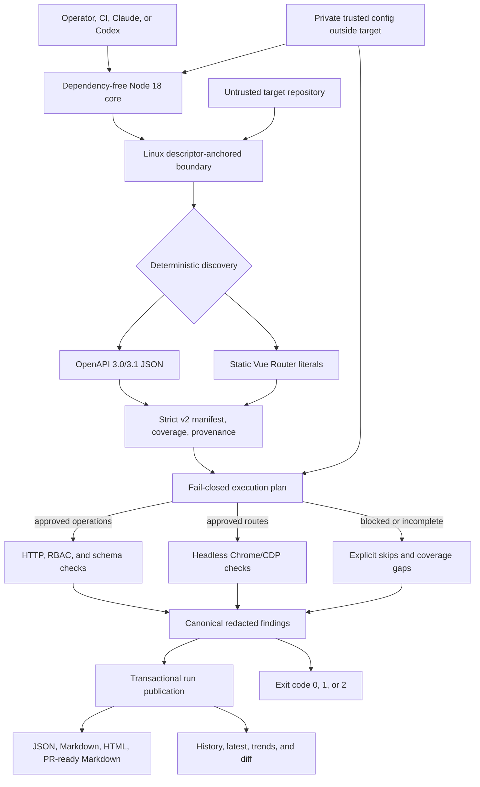

# Sentinel

Sentinel is a deterministic QA runner for a deliberately bounded class of web
applications. Given a private operator configuration, an untrusted target
repository, and a running development or test deployment, it discovers supported
OpenAPI operations and Vue Router routes, applies a fail-closed execution policy,
runs real API and headless-Chrome checks, and publishes one canonical set of
redacted findings.

Sentinel 2.0.1 is a breaking replacement for the prompt-owned 1.x execution model.
The current implementation and release-evidence status are tracked in
[PROGRESS.md](PROGRESS.md). Do not treat source completion alone as proof that the
release goal has passed; the real API/Chrome, packaging, exact-commit CI, tag, and
fresh-archive gates must all succeed.

## Product goal

Sentinel answers this bounded question:

> Can the supported surface of this application be discovered and exercised across
> trusted roles and browser viewports without allowing target content to grant
> network, mutation, credential, or filesystem authority—and can every result be
> reproduced from one validated run?

It is a QA orchestration layer, not a claim that an application is defect-free. It
does not replace unit, integration, accessibility, load, security, framework-native,
or manual testing.



The Claude plugin and Codex launcher are thin hosts for the same core. Target source,
comments, pages, responses, redirects, manifests, and old reports are always data;
they cannot override policy or become host instructions.

## Deterministic support matrix

Sentinel 2.0 makes an execution claim only for the following matrix:

| Surface | Supported form | Explicit boundary |
|---|---|---|
| Backend discovery | OpenAPI 3.0.x or 3.1.x JSON, literal relative paths, local `#/components/schemas/*` references, and the schema subset accepted by the bundled contracts | External references, callbacks/webhooks, non-JSON content, and unsupported schema behavior are partial or unsupported |
| Frontend discovery | Static Vue Router literal arrays, including nested routes, aliases, absolute children, and path parameters | Spreads, imported/computed route arrays, interpolated templates, and other dynamic expressions are coverage gaps |
| Authentication | Bearer tokens supplied as `env:NAME` references plus explicit trusted role mappings | Cookie sessions, OAuth flows, API keys, Basic auth, and inferred role hierarchies are not 2.0 execution claims |
| API checks | Exact-origin status/RBAC, content type, bounded JSON responses, supported response schemas, timeouts, and manually validated same-origin redirects | Cross-origin redirects and unapproved origins are blocked |
| Browser checks | System Chrome/Chromium over CDP: document/RBAC status, network failures, console errors, uncaught exceptions, horizontal overflow, configured empty content, and screenshots on configured failures | Firefox/WebKit, accessibility audits, arbitrary target-authored checks, and pixel-perfect visual regression are outside the claim |
| Runtime | Linux, Node.js 18+, and a system or explicitly configured Chrome/Chromium executable | Other operating systems are outside the release matrix while safe filesystem anchoring depends on Linux procfs descriptor paths |
| Service scope | Config may contain zero or one canonical approved origin and zero or one configured service; executable API/browser work requires exactly one approved origin | Multiple distinct origins/services are rejected with `CONFIG_MULTI_SERVICE_UNSUPPORTED`; run one invocation per service |

Legacy prompts may help explain an unsupported stack, but they cannot upgrade
coverage, enter the canonical manifest, or authorize a request. The broad 1.x claims
for framework source parsers, GraphQL/gRPC/tRPC, ORMs, automatic fixes, direct PR
mutation, and Playwright MCP are intentionally not 2.0 execution claims.

## Prerequisites

- Linux with `/proc` mounted.
- Node.js 18 or newer. The runtime has zero npm dependencies.
- For executable work, a running development or test application at exactly one
  operator-approved `http` or `https` origin. A zero-origin config is valid for
  discovery/readiness but cannot authorize API or browser execution.
- OpenAPI 3.0/3.1 JSON and/or static Vue Router source files inside the target.
- A system Chrome/Chromium executable for `browser` and `sweep`. Sentinel checks a
  fixed system list or an absolute `chromePath`; it rejects target-local browsers.
- Bearer tokens in environment variables when protected roles are tested.
- A trusted configuration file outside the target repository.

## Installation and entrypoints

### Claude Code plugin

```bash
claude plugin marketplace add https://github.com/michelabboud/sentinel-sweep
claude plugin install sentinel
```

Invoke the packaged skill as `/sentinel:run`, for example:

```text
/sentinel:run setup --target /srv/apps/example --config /home/alice/.config/sentinel/example.json --json
```

The host asks permission for one packaged-core invocation. It does not inspect the
target or implement a second policy.

### Direct Node or Codex launcher

From a source checkout:

```bash
node runtime/cli.mjs --help
./codex/bin/sentinel-codex.sh --help
```

`codex/install.sh` can add the launcher to `~/.local/bin`. The Python launcher checks
for Node 18+ and then replaces itself with the same `runtime/cli.mjs` process, so
arguments and exit status are preserved.

## Trusted configuration

The config file is authority. Sentinel therefore requires it to be:

- explicitly supplied with `--config`;
- outside the target root, both lexically and canonically;
- a regular, non-symlinked file with exactly one hard link;
- owned by the current effective user; and
- mode `0600` or `0400` on POSIX.

The file contains secret references, never secret values. `reportDir` is a relative
path beneath the target. Sentinel appends `sentinel-v2`, keeping 2.0 artifacts
isolated from 1.x history.

Create the directory privately and create the config at its final private mode before
editing it:

```bash
install -d -m 0700 /home/alice/.config/sentinel
install -m 0600 codex/config.example.json /home/alice/.config/sentinel/example.json
```

Example external config for one service and one exact origin. The override hashes
shown correspond to `GET /api/admin` and route `/admin` in this illustrative target;
replace them with IDs produced by your own `manifest` command.

```json
{
  "schemaVersion": "2.0",
  "reportDir": "sentinel-reports",
  "approvedOrigins": [
    "http://127.0.0.1:4173"
  ],
  "services": [
    {
      "name": "example",
      "approvedOrigin": "http://127.0.0.1:4173"
    }
  ],
  "roles": {
    "admin": {
      "tokenRef": "env:SENTINEL_ADMIN_TOKEN"
    },
    "user": {
      "tokenRef": "env:SENTINEL_USER_TOKEN"
    }
  },
  "allowMutations": false,
  "mutationAllowlist": [],
  "allowNonLoopback": false,
  "targetEnvironment": "test",
  "requireCompleteCoverage": true,
  "responseTimeoutMs": 5000,
  "browserSettleMs": 500,
  "viewports": [375, 768, 1280],
  "screenshotOnError": true,
  "discovery": {
    "openapi": ["openapi.json"],
    "vueRouter": ["src/router.js"]
  },
  "trustedOverrides": {
    "operations": {
      "4ebcfbf48f6c96aeeb09c6a09bb2ae383d006ff8198a62c0fe6a1d3335c00acf": {
        "allowedRoles": ["admin"]
      }
    },
    "routes": {
      "9fce8a089929fb3b2fcd7c2b4f4dabd2aa5f0ad6581e4eb955b5308bfd0ad345": {
        "allowedRoles": ["admin"]
      }
    }
  }
}
```

Override IDs must match discovered stable IDs. A practical first pass is to omit
`trustedOverrides`, run `manifest`, inspect the generated IDs and coverage, then add
only the role or parameter evidence the operator can vouch for. Unknown override IDs
fail instead of being silently ignored.

Loopback origins are not implicitly trusted: the exact scheme, host, and port must
still appear in `approvedOrigins`. Non-loopback origins also require
`allowNonLoopback: true`. A configured origin cannot contain credentials, a base
path, query, or fragment.

### One service per invocation

Sentinel 2.0 does not attach service identity to every discovered manifest subject,
so accepting multiple origins would make execution ambiguous. The loader therefore
canonicalizes and deduplicates equivalent origins and accepts at most one distinct
approved origin and at most one service. Zero origins remains valid for discovery
and readiness, but no API or browser decision can execute until exactly one is
approved; a configured service must reference that sole approved origin, so a
zero-origin config has no service entry. To test multiple services, create one
private config per service and invoke Sentinel separately. Their `reportDir` values
may be different relative paths if separate histories are desired.

## Quick start

Assume the application is already running and the config above has been reviewed:

```bash
export SENTINEL_ADMIN_TOKEN='sentinel-admin-example+canary/2026alpha=='
export SENTINEL_USER_TOKEN='sentinel-user-example+canary/2026beta=='

node runtime/cli.mjs setup \
  --target /srv/apps/example \
  --config /home/alice/.config/sentinel/example.json \
  --json

node runtime/cli.mjs manifest \
  --target /srv/apps/example \
  --config /home/alice/.config/sentinel/example.json \
  --output /tmp/example-sentinel-manifest.json \
  --json

node runtime/cli.mjs api \
  --target /srv/apps/example \
  --config /home/alice/.config/sentinel/example.json \
  --json

node runtime/cli.mjs sweep \
  --target /srv/apps/example \
  --config /home/alice/.config/sentinel/example.json \
  --json
```

The values above are non-production canaries accepted by Sentinel's bearer-token
syntax; replace them through your secret system for an authorized test target. Do
not paste real token values into config, command arguments, logs, issue reports, or
chat.

During command initialization, the core resolves currently available configured
secrets to build its redactor. At execution, each selected API or browser engine
synchronously captures only the planned-role credentials before that engine begins
application I/O; it does not resolve a token separately for every request. Values
stay inside core memory and are redacted before validation and persistence. `setup`
also resolves role references only to report current availability and makes no
application requests. Chrome receives a fixed minimal environment with run-scoped
`HOME`, `XDG_CONFIG_HOME`, and `TMPDIR` directories (`XDG_CACHE_HOME` is isolated as
well), so bearer-token environment variables are not inherited by the browser
process.

## Setup readiness

`setup` performs real discovery and policy planning without issuing application
requests. Its JSON includes:

| Field | Meaning |
|---|---|
| `discoveryAvailable` | The configured adapters produced a valid v2 manifest |
| `coverage` | Aggregate `complete`, `partial`, or `unsupported` discovery status |
| `apiReady` | Coverage satisfies policy, at least one API operation is executable, and every role needed by executable API decisions has an available secret |
| `browserReady` | Coverage satisfies policy, at least one route is executable, required route credentials are available, and trusted/system Chrome resolves |
| `sweepReady` | Both `apiReady` and `browserReady` are true |
| `executionReady` | Compatibility alias for `sweepReady`; it is not an API-only readiness signal |
| `roles` | Each configured role and whether its environment secret is currently available |
| `chromeAvailable` | A trusted absolute or allowlisted system Chrome executable resolves |

With `requireCompleteCoverage: true`, partial or unsupported discovery makes all
readiness fields false. Missing Chrome can leave `apiReady: true` while
`browserReady` and `sweepReady` are false. Setup completing with exit code `0` does
not mean every readiness field is true; inspect the returned fields before execution.

## Commands

Every command requires `--target` and `--config`; flags use space-separated values,
not `--flag=value`.

| Command | Purpose and required command-specific arguments |
|---|---|
| `setup` | Discover and report per-mode readiness without application requests |
| `manifest --output <path>` | Write a strict v2 manifest to one private output file |
| `api [--run-id <id>]` | Run approved API operations only |
| `browser [--run-id <id>]` | Run approved browser routes only |
| `sweep [--run-id <id>]` | Require both API and browser engines; both must complete before publication |
| `report --run <id> --output <path>` | Copy validated canonical Markdown for an existing run |
| `dashboard --run <id> --output <path>` | Copy the self-contained static HTML dashboard for an existing run |
| `export --run <id> --format <postman\|insomnia\|bruno> --output <path>` | Create a credential-free collection tree from the run manifest |
| `trends` | Return canonical run summaries and consecutive deltas |
| `diff --run <newer-id> --against <older-id>` | Compare stable finding identities and canonical summaries |
| `clean --keep <1-128>` | Transactionally retain the newest requested run count |
| `--help`, `--version` | Sole-argument metadata invocations |

`--json` makes stdout a single machine-readable result. Execution commands also
accept `--sandbox-acknowledged`, but that flag does not itself authorize a mutation.
In non-interactive use, acknowledgement additionally requires an explicit `--run-id`
and `SENTINEL_CI_SANDBOX_ACK` equal to that exact ID.

Unknown commands, duplicate or inapplicable flags, positional extras, control
characters, empty values, and equals-form flags fail with exit code `1`.

## Execution and mutation policy

`GET`, `HEAD`, and `OPTIONS` are read-only for policy purposes, but they still need
an exact origin, complete required parameters, known auth, a declared response, and
known side effects. Every discovered operation or route receives an explicit execute
or skip decision; skipped work remains visible in findings.

Every other HTTP method is a mutation, regardless of a source-provided label. It can
execute only when all six conditions are true:

1. trusted config sets `allowMutations: true`;
2. the exact stable operation ID is in `mutationAllowlist`;
3. trusted overrides establish known side effects and nonblank rollback instructions;
4. `targetEnvironment` is `development` or `test`;
5. the operation resolves to the exact approved origin; and
6. the invocation includes a valid explicit sandbox acknowledgement.

Authentication and required parameter evidence must also be complete. Target source
can raise risk or expose a gap, but it cannot satisfy any approval condition. Keep
mutations disabled unless the target is disposable and the rollback is real.

## Artifacts and canonical result

For the default `reportDir`, completed runs are published under:

```text
<target>/sentinel-reports/sentinel-v2/
├── <UTC-run-id>/
│   ├── .sentinel-run-identity-v2
│   ├── sentinel-manifest.json
│   ├── sentinel-findings.json
│   ├── sweep.md
│   ├── dashboard.html
│   ├── pr-comment.md
│   └── browser-<digest>.png       # only for configured captured failures
├── sweep-history.json
└── latest -> <UTC-run-id>
```

Directories are private (`0700`) and files are private (`0600`). Publication is
transactional: a failed engine, invalid artifact, or failed durable write does not
advance history or `latest`.

`sentinel-findings.json` is the canonical result. Its summary is computed once and
consumed by Markdown, dashboard, PR-ready Markdown, history, trends, diff, and exit
status. These consumers do not independently reinterpret findings.

## Exit codes

| Code | Contract |
|---:|---|
| `0` | The command completed. For an execution command, the completed findings contain no critical or error finding. For `setup`, inspect readiness fields separately. |
| `1` | Usage, config, readiness, runtime, required-engine, validation, or publication failure; no successful partial sweep is claimed. |
| `2` | The execution completed and the canonical findings contain at least one critical or error finding. This is completed-with-findings, not a runtime failure. |

## Security model and limitations

- Exact origins and every redirect are revalidated before credential-bearing work.
- Secret values remain transient and are redacted before validation and persistence.
- Sentinel never scans `.env`, seed, SSH, cloud, or arbitrary documentation files for
  credentials.
- Discovery does not evaluate JavaScript, import target modules, or invoke
  target-local executables.
- Coverage is `complete`, `partial`, or `unsupported`; unsupported discovery cannot
  masquerade as a clean zero-route run.
- The Linux descriptor and identity checks resist path and symlink substitution, but
  they are not a sandbox against a malicious process running as the same Unix UID
  with write access to the output parent. Same-UID concurrency must be cooperative.
  Isolate hostile target code under another user or stronger sandbox.
- Exports contain variable references rather than credential values. PR-ready
  Markdown is an artifact; Sentinel does not publish or mutate a pull request.

See [SECURITY.md](SECURITY.md) for disclosure and operating guidance and
[ARCHITECTURE.md](ARCHITECTURE.md) for the component and trust-boundary design.

## Migrating from 1.x

Sentinel does not silently interpret 1.x manifests or settings. The migration is a
new trusted configuration and rediscovery, not an in-place data conversion. Old
history remains separate from the `sentinel-v2` root.

Follow [Migrating from Sentinel 1.x to 2.0](docs/guides/migrating-to-2.0.md) for the
removed flags/claims, config conversion, per-service invocation pattern, and rollout
sequence.

## Development and evidence

```bash
npm test
npm run lint
npm run audit
bash tests/e2e/clean-install.test.sh
bash tests/e2e/plugin-install.test.sh
```

The canonical 28-issue review, remediation table, goal flow, residual risks, and
release-evidence placeholders are in
[docs/reports/2026-07-18-sentinel-plugin-review-and-architecture.md](docs/reports/2026-07-18-sentinel-plugin-review-and-architecture.md).
Contributor workflow is in [CONTRIBUTING.md](CONTRIBUTING.md), and sweep history is
specified in [docs/sweep-history-spec.md](docs/sweep-history-spec.md).

## License

Apache-2.0. See [LICENSE](LICENSE).
