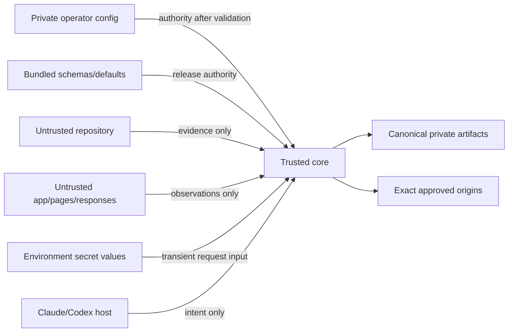

# ADR 0001: Deterministic Trusted Core

**Date:** 2026-07-18  
**Status:** Accepted; implementation is in progress and release verification is pending  
**Owners:** Sentinel maintainers

## Context

Sentinel 1.x described an ambitious QA plugin in natural-language agent prompts. The
same prompt was expected to discover frameworks, parse routes and schemas, read
credentials, classify risk, choose origins, merge manifests, execute requests, and
write reports. Target repository text was therefore processed by a tool-capable LLM
inside the safety boundary.

The 2026-07-18 review found that this design was nondeterministic and fail-open. An
untrusted repository could influence commands, URLs, credentials, risk, and output
paths; unsupported frameworks could look like empty successful discovery; and the
reviewed `sentinel-plugin` folder was only a stale agent extraction rather than an
installable product. The adjacent canonical repository contained more packaging,
but its broad execution claims still lacked an enforceable and end-to-end-proven
boundary.

Sentinel needs the LLM's coordination and explanation strengths without asking it
to be the sole parser, reference monitor, secret handler, or artifact validator.

## Decision

Sentinel 2.0 places all safety-critical behavior in one dependency-free Node.js 18+
core shared by Claude and Codex hosts.

The core will:

1. treat the target repository, imported contracts, pages, responses, redirects,
   and existing artifacts as untrusted data;
2. accept authority only from bundled release assets and an explicit, private,
   schema-valid operator configuration outside the target repository;
3. discover only OpenAPI 3.0/3.1 JSON and static Vue Router literals for the 2.0
   deterministic execution claim;
4. represent coverage as `complete`, `partial`, or `unsupported`, with provenance;
5. validate strict v2 settings, manifest, findings, and history contracts;
6. apply trusted overrides only by stable discovered identity;
7. approve exact HTTP(S) origins and follow redirects manually without crossing an
   approved origin;
8. keep bearer-token values transient, resolving `env:NAME` references only inside
   the trusted core and redacting before persistence;
9. produce an explicit execute/skip decision for every discovered subject and block
   unknown mutations by default;
10. run API checks with built-in `fetch` and browser checks through a trusted system
    Chrome/Chromium executable over CDP;
11. normalize observations into one canonical findings document from which every
    report, history record, trend, diff, and exit code is derived; and
12. publish private run-scoped artifacts transactionally, using Linux descriptor
    anchors and identity revalidation before advancing history or `latest`.

During command initialization, the core resolves currently available configured
secrets to build its redactor. At execution, each selected API or browser engine
synchronously captures only the planned-role credentials before that engine begins
application I/O; it does not resolve a token separately for every request. Values
stay inside core memory and are redacted before validation and persistence. `setup`
also resolves role references only to report current availability and makes no
application requests. Chrome receives a fixed minimal environment with run-scoped
`HOME`, `XDG_CONFIG_HOME`, and `TMPDIR` directories (`XDG_CACHE_HOME` is isolated as
well), so bearer-token environment variables are not inherited by the browser
process.

Because discovered v2 subjects do not carry an independently proven service/origin
binding, the core accepts zero or one canonical approved origin and zero or one
configured service per invocation. A zero-origin config remains useful for discovery
and readiness but cannot authorize API/browser execution; executable work requires
exactly one. A configured service must reference that sole origin, so zero-origin
config has no service entry. Multiple distinct origins/services fail closed.
Multi-service repositories use one external config and invocation per service until a future,
fully modeled service identity contract supersedes this ADR.

The LLM host may invoke the core, select commands, explain coverage gaps, and propose
remediation. It may not grant an origin, lower risk, supply a secret value, turn
partial coverage into complete coverage, or bypass a core rejection.

Mutation execution requires all of: trusted `allowMutations`, an exact stable-ID
allowlist entry, known side effects and rollback, a development/test environment, an
approved exact origin, and explicit sandbox acknowledgement. Repository metadata can
raise risk but cannot satisfy those conditions.

The public support claim is deliberately narrow. Broader framework/auth/ORM knowledge
from legacy prompts is unverified enrichment, not deterministic execution support.

## Trust boundary

Filesystem containment relies on Linux procfs descriptor anchoring,
no-follow/exclusive creation, private ownership/modes, and device/inode checks. This
is not a sandbox against a malicious process running as the same Unix UID with write
access to the output parent. Same-UID output publication therefore has a cooperative
concurrency assumption; operators needing a hostile-code boundary must isolate the
target under another account or sandbox.

## Alternatives rejected

### Patch the prompt-only implementation

Rejected because prose cannot provide deterministic parsing, origin containment,
secret non-disclosure, atomic publication, or a testable policy boundary. It would
leave target instructions and LLM behavior inside the reference monitor.

### Restore and expand the Sentinel 1.8.5 prompts

Rejected because adding more framework instructions increases an already unproved
surface. It can improve explanation, but does not make broad support or mutation
safety observable and enforceable.

### Execute target code or import target toolchains for discovery

Rejected because it grants untrusted install hooks, modules, and executables host
authority. Static adapters may report partial coverage instead.

### Use Playwright or another runtime dependency

Rejected for the initial trusted core. Built-in Node APIs plus direct CDP keep the
shipped runtime auditable and avoid installing or resolving a target-local browser
package. This choice can be superseded if a vetted dependency materially improves
correctness without weakening the boundary.

### Preserve the broad 1.x support claims and label them best-effort

Rejected because unsupported discovery that returns no defects is misleading.
Sentinel will claim only the matrix it can prove end to end.

### Accept multiple origins and infer service binding from config order

Rejected because v2 operations and routes do not carry an independently proven
service identity. Config order or a single-item fallback cannot safely decide which
origin receives credentials. Sentinel instead fails closed and requires one
config/invocation per service until the manifest, policy, findings, and E2E contracts
model service identity end to end.

## Consequences

### Positive

- Safety decisions and output contracts are deterministic and directly testable.
- Claude and Codex use the same implementation, avoiding policy drift.
- Coverage gaps, policy skips, and engine failures cannot masquerade as a clean run.
- Exact-origin checks, secret references, and canonical artifacts reduce the risk of
  SSRF, credential leakage, and inconsistent reporting.
- A narrow support matrix gives each claimed behavior a realistic end-to-end gate.

### Costs and limitations

- Version 2.0 is a breaking settings, manifest, command, and safety-policy change.
- OpenAPI JSON, static Vue Router, bearer roles, and Chrome/Chromium are the only
  deterministic execution slice; many 1.x advertised technologies are not supported.
- Linux is required while the filesystem boundary depends on procfs descriptor paths.
- Dynamic route code is reported as partial instead of executed or guessed.
- Multi-service repositories require separate invocations and histories; accepting
  ambiguous multi-origin authority was rejected for 2.0.
- Mutation setup is intentionally demanding and may require explicit parameter,
  side-effect, and rollback evidence.
- Same-UID hostile output races remain outside the protection boundary.

## Operational consequences

- Trusted configuration must be supplied explicitly from outside the target and
  kept private; target-owned `settings.json` is not execution authority.
- 1.x manifests are rejected rather than silently migrated.
- Hosts must propagate the core's `0`/`1`/`2` exit semantics without inventing
  success.
- Setup reports `apiReady`, `browserReady`, and `sweepReady`; its legacy
  `executionReady` field is an alias for `sweepReady`, not an API-only signal.
- Release acceptance requires a real supported target, real HTTP and Chrome checks,
  secret/mutation/cross-origin canaries, clean-package installation, mirror parity,
  Node 18 verification, and exact-commit CI.

## Rollback

A release rollback must restore an immutable previously published release; it must
not make the v2 core silently accept v1 manifests or restore broad claims under v2
contracts. Any future reversal of this decision requires a superseding ADR that
provides an equally enforceable trust model, migration rules, and end-to-end proof.

## Verification state

The implementation modules and focused tests exist in the canonical repository, but
this ADR does not assert that the final release gates have passed. Acceptance remains
pending until it is recorded against the exact release commit in the
[canonical review report](../reports/2026-07-18-sentinel-plugin-review-and-architecture.md).
