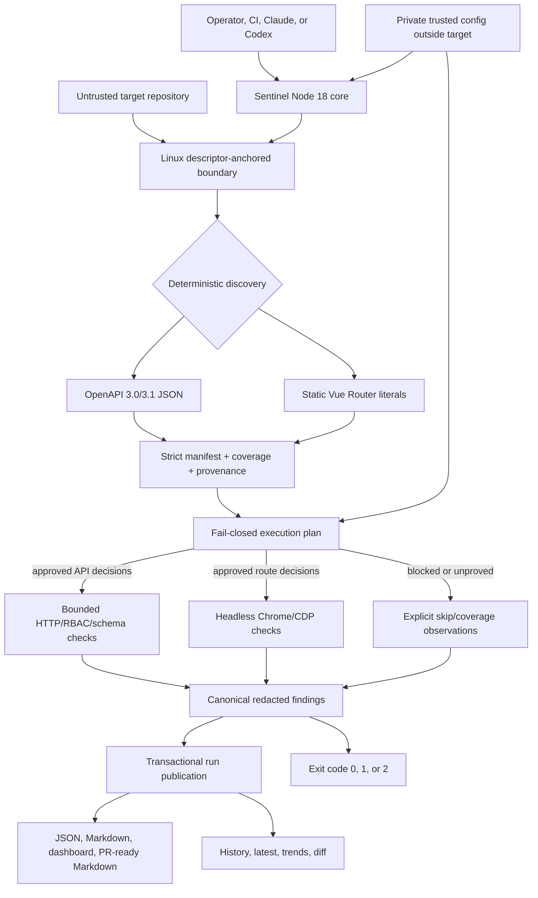

# Sentinel Plugin Review, Architecture, and Goal-Readiness Assessment

**Original review date:** 2026-07-18  
**Canonical report status:** remediation implementation in progress; final verification and release pending  
**Historical workspace reviewed:** `/home/michel/projects/sentinel-plugin`  
**Canonical repository:** `/home/michel/projects/sentinel-sweep`  
**Accepted Task 9 snapshot:** `32bfa4b`; Task 11 and documentation/release integration remain pending  
**Final release commit:** pending — record the exact tested main SHA here  
**Exact-main-SHA CI:** pending — record the workflow run URL and conclusion here  
**Release/tag/archive proof:** pending — record tag, GitHub release URL, and fresh-archive result here

## Preface

This is the durable canonical copy of the review first written in the obsolete
`sentinel-plugin` extraction. That folder contained only an old
`agents/manifest-generator.md`; it was evidence for the historical findings, not the
repository to repair. Remediation is being implemented in `sentinel-sweep` under the
approved [2.0 design](../superpowers/specs/2026-07-18-sentinel-2.0-goal-hardening-design.md),
[implementation plan](../superpowers/plans/2026-07-18-sentinel-2.0-goal-hardening.md),
and [ADR 0001](../adr/0001-deterministic-trusted-core.md).

Statuses in this report distinguish source implementation from proof:

- **Implemented; gate pending** means the canonical source contains the remediation,
  but this report does not claim the final release suite has passed.
- **Resolved by narrowed claim; gate pending** means Sentinel intentionally removed
  an unproved 1.x behavior from the 2.0 execution contract.
- **Corrected repository state** means the finding applied to the obsolete extraction
  and the work now lives in the auditable canonical Git repository.
- **In progress** means packaging or goal-level proof is still incomplete.

The pending fields above are intentionally explicit handoff points. Replace them
only with evidence from the exact release commit; do not substitute a feature-branch
SHA, focused test, or source inspection.

## Executive assessment

Sentinel's goal is useful and achievable for a deliberately bounded support matrix:
discover supported web surfaces, plan every action through a fail-closed policy,
exercise real API and browser behavior across trusted roles, and publish one
redacted, reproducible result that drives every consumer.

The historical `sentinel-plugin` folder could not do that. It was not installable and
placed parsing, secrets, origin choice, risk, and output authority in a free-form
agent prompt. The canonical repository now contains a deterministic Node.js core,
strict schemas, OpenAPI and Vue discovery, API and Chrome runners, canonical
findings, and transactional history. Those changes address or deliberately narrow
the code-level causes in the 28-item register; packaging, goal-level proof, and
release-integrity items remain open until their listed gates pass.

That is not yet a release-success claim. Sentinel reaches its goal only after the
exact release commit passes the real supported-target E2E gate, adversarial and
secret canaries, concurrency/crash recovery, clean archive/plugin installation,
Node 18, mirror parity, and remote exact-commit CI. Until then, the honest answer is:

> **The architecture can reach the core goal for the documented OpenAPI + static Vue
> Router + bearer roles + Chrome/Chromium matrix, but final goal attainment remains
> pending observable release evidence. It will not provide the old unproved broad
> framework/auth/ORM feature matrix.**

## Product goal and flow

Sentinel is intended to answer:

> Given a trusted operator configuration, an untrusted target repository, and a live
> development or test deployment, can an automated tool safely discover the
> supported testable surface, exercise it across roles and viewports, identify
> regressions and access-control failures, and leave a reproducible report?



One sweep loads and validates private external config, pins the target boundary,
discovers only configured adapter inputs, validates the manifest, creates an explicit
decision for every subject, runs the selected required engines, normalizes and
redacts observations, then publishes a run only if its canonical artifacts validate.
History and `latest` advance after complete publication, never after a partial engine
or write failure.

`setup` exercises discovery and planning without issuing application requests. It
reports `apiReady`, `browserReady`, and `sweepReady`; `executionReady` is a
compatibility alias for `sweepReady`. Readiness requires executable work, acceptable
coverage, and the credentials needed by executable decisions; browser readiness also
requires trusted/system Chrome. A successful setup command can therefore report one
or more readiness fields as false.

## Historical evidence snapshot

Before the original report, the reviewed folder contained only:

```text
sentinel-plugin/
└── agents/
    └── manifest-generator.md
```

It had no plugin manifest, entrypoint, settings, sweepers, reporter, tests, or Git
history. The 675-line reviewed agent had SHA-256
`c0a96aa391efaecba10576e3417737d7461b5e909ad510c4157c56855be5754c`.
The adjacent source package and installed Sentinel 1.8.5 copies were identical
2,157-line files with SHA-256
`82c22b9b88db0dc5ecc8bb75fc43515057a6187dbd5a7f97e50955eeee6d42aa`.
Those facts established that the folder was a stale extraction, not the maintained
product.

## Complete issue register and remediation state

All evidence references in the “original finding” column describe the historical
agent unless explicitly identified as workspace inventory. Current paths describe
the canonical repository. “Gate pending” is deliberate: presence of code is not a
substitute for the final acceptance run.

| # | Severity | Area | Original evidence and finding | Required correction | Status | Canonical evidence and remaining gate |
|---:|---|---|---|---|---|---|
| 1 | Critical | Security | `agents/manifest-generator.md:5,62,103,232,359,429`: untrusted repository text reached an agent with unrestricted Bash/Write, enabling prompt-driven commands, external reads, or overwrite. | Move safety-critical parsing into deterministic, network-disabled code with pinned reads and constrained output. | Implemented; gate pending | `runtime/discovery/`, `runtime/lib/fs-boundary.mjs`, and thin host contracts in `tests/contract/host-prompts.test.mjs`; adversarial packaged-host proof remains in the final gate. |
| 2 | Critical | Security | `:60-72,599-617`: repository URLs and implicit ports 3000/8000 enabled SSRF or tests against the wrong service. | Require exact trusted HTTP(S) origins, reject userinfo/base paths, and block cross-origin redirects. | Implemented; gate pending | `runtime/lib/origin.mjs`, `runtime/api/http.mjs`, `runtime/browser/sweep.mjs`; final receiver counter must prove no credential crosses origin. |
| 3 | High | Secrets | `:99-116,611-617,644`: plaintext passwords were harvested and persisted. | Store secret references only, resolve at execution, redact every artifact/output. | Implemented; gate pending | `schemas/settings.schema.json`, `runtime/lib/secrets.mjs`, `runtime/findings.mjs`; exact release secret-canary scan pending. |
| 4 | High | Secrets | `:62-65,670`: whole environment files were read to find URLs, exposing unrelated credentials. | Read only allowlisted non-secret adapter inputs; never scan `.env`. | Implemented; gate pending | `runtime/lib/fs-boundary.mjs` blocks `.env` and secret-like inputs; configured OpenAPI/Vue files are the discovery surface. Final adversarial `.env` canary pending. |
| 5 | High | Filesystem | `:62,556,644`: inputs/output lacked canonical-path and symlink checks. | Pin roots, reject symlink/out-of-root inputs, publish privately and atomically. | Implemented; gate pending | `runtime/lib/fs-boundary.mjs`, `runtime/lib/output-boundary.mjs`, `runtime/history.mjs`; final descriptor-race and crash tests pending. The same-UID limitation remains documented below. |
| 6 | High | Packaging | Workspace inventory and plugin validator: no manifest, entrypoint, settings, sweepers, reporter, or installable package. | Restore a complete versioned package and validate clean installation. | In progress | Canonical package, hosts, runtime, schemas, and mirror exist; 2.0 version/mirror sync, clean archive, Claude validator, Codex install smoke, and release proof remain pending. |
| 7 | High | Integration | `:556,644`; old orchestrator `commands/sentinel.md:408-410`: project-root and run-scoped manifest paths disagreed. | Use one explicit run scope for all artifacts and consumers. | Implemented; gate pending | `runtime/cli.mjs` and `runtime/history.mjs` publish `sentinel-manifest.json` with canonical findings/reports in one immutable run directory. |
| 8 | Medium | Provenance | Recorded file lengths/hashes: reviewed copy diverged from source/installed copies and had no sync mechanism. | Establish one canonical source and generated install mirror. | Corrected repository state | Work occurs in Git-backed `sentinel-sweep`; root assets are canonical and parity is a release gate. Final 2.0 mirror hash proof remains pending. |
| 9 | High | FastAPI | `:226,290,313-317`: prefix self-audit could delete valid mounted FastAPI endpoints. | Prove router mount graphs or replace the unsupported claim. | Resolved by narrowed claim; gate pending | 2.0 imports literal operations from OpenAPI JSON in `runtime/discovery/openapi.mjs`; it does not claim FastAPI source extraction. E2E OpenAPI exactness pending. |
| 10 | High | Coverage | `:20-38,134,214`: many frameworks were detected but only Vue/FastAPI were extracted, so unsupported apps looked empty and clean. | Implement proven adapters or report partial/unsupported explicitly. | Implemented and narrowed; gate pending | `runtime/discovery/index.mjs`, manifest/findings schemas, and `requireCompleteCoverage`; final supported/adversarial target proof pending. |
| 11 | High | FastAPI | `:31,262-266`: scanning only `endpoints` directories omitted common router layouts and direct decorators. | Follow real registration or remove the source-parser claim. | Resolved by narrowed claim; gate pending | OpenAPI import replaces FastAPI directory heuristics; FastAPI source discovery is not a 2.0 claim. |
| 12 | High | FastAPI | `:232-277`: shallow literal prefix resolution missed nested routers, constants, aliases, and cycles. | Build a proven graph or require a trusted contract. | Resolved by narrowed claim; gate pending | Exact OpenAPI paths are the backend authority; unsupported references/patterns become coverage diagnostics. |
| 13 | High | Authorization | `:295-299`: three dependency names missed router/decorator scopes and could mark protected endpoints public. | Use explicit trusted role mappings and preserve unknown auth. | Implemented; gate pending | `schemas/settings.schema.json`, OpenAPI security parsing, trusted stable-ID overrides, and `runtime/policy/execution.mjs`; E2E role matrix pending. |
| 14 | High | Safety | `:441-463,575-579`: POST was “safe” and PUT/PATCH “medium,” so default policy could mutate billing, messaging, deployment, or data. | Block unknown mutations; require trusted, sandboxed approval. | Implemented; gate pending | `runtime/policy/execution.mjs` requires all six mutation conditions; final POST/DELETE zero-counter proof pending. |
| 15 | High | Merge security | `:556-569`: committed manual entries survived without validation, origin checks, or risk recomputation. | Separate trusted overrides from repository evidence and revalidate. | Implemented; gate pending | External private config plus stable-ID overrides in `runtime/discovery/index.mjs`; committed target manifests have no authority. Malicious-manifest fixture pending final gate. |
| 16 | High | Merge correctness | `:569`: regeneration overwrote app/auth/URLs/risk policy, losing corrected credentials and skip protections. | Define field ownership and merge by provenance. | Implemented; gate pending | Generated manifest remains evidence; authority stays in external config and is applied after schema validation by stable identity. |
| 17 | High | Merge correctness | `:565-568`: no stable de-duplication; conflicting requests could execute twice and overrides disappear. | Merge by canonical IDs and reject conflicts/orphans. | Implemented; gate pending | `runtime/lib/identity.mjs` and `runtime/discovery/index.mjs` deduplicate semantic equals, reject conflicts, and reject unknown override IDs. |
| 18 | High | Schemas | `:357-401`: Pydantic extraction missed inheritance, aliases, serialization fields, and qualified identity. | Resolve proven endpoint schemas with collision-safe IDs or remove claim. | Resolved by narrowed claim; gate pending | OpenAPI local components receive qualified schema identities; Pydantic source parsing is not a 2.0 claim. Supported schema-subset E2E pending. |
| 19 | High | CRUD | `:301,330-349,510-548`: only response schemas existed, so create/update bodies could be invented from output models. | Model request bodies, parameters, and responses separately. | Implemented; gate pending | `runtime/discovery/openapi.mjs`, manifest schema, API runner, and `runtime/export.mjs` keep request/response contracts separate. Export goal tests pending. |
| 20 | High | Parameters | `:168-184,321-328`: lookup expressions assumed list responses and an `id` field. | Require proven examples or explicit trusted configuration. | Implemented; gate pending | OpenAPI examples and qualified `trustedOverrides.*.parameterExamples` feed policy; missing required examples cause explicit skip. |
| 21 | High | Risk scoring | `:429-455`: no target model/delete mode evidence, so cascade and hard-delete risk were guessed. | Store explicit target, delete mode, side effects, rollback, and recompute risk. | Implemented; gate pending | Manifest/config contracts and `runtime/policy/execution.mjs` represent these fields and keep unknown mutations blocked. |
| 22 | Medium | CRUD | `:510-548`: two GETs could become an executable CRUD lifecycle without a create step. | Require proven create semantics or represent read-only work explicitly. | Resolved by narrowed claim; gate pending | 2.0 plans individual discovered operations; it does not infer or claim executable CRUD lifecycle synthesis. |
| 23 | Medium | Vue | `:138,162,674`: contradictory first/all-router behavior and incorrect prefixing of absolute child routes. | Parse all configured routers deterministically with Vue path semantics. | Implemented; gate pending | `runtime/discovery/vue-router.mjs` handles configured files, nested/empty/absolute children, aliases, and parameters; dynamic expressions remain partial. E2E exact routes pending. |
| 24 | Medium | Configuration | `:573-582` plus inventory: absent settings caused hard-coded fallback behavior. | Package a strict schema/defaults and require explicit resolved config. | Implemented; gate pending | `settings.json`, `schemas/settings.schema.json`, and `runtime/lib/config.mjs`; the target repository's settings do not grant execution authority. |
| 25 | Medium | Authentication | `:89-97,613`: login endpoint had no absent state but was always emitted. | Represent missing authentication explicitly and make consumers fail closed. | Implemented; gate pending | Manifest auth state and trusted bearer-role mapping use explicit required/public/unknown semantics; no login endpoint is invented. |
| 26 | Medium | Data accuracy | `:10,120-128`: prompt forbade invention but fabricated admin/user hierarchy. | Preserve unknown authorization and require trusted mapping. | Implemented; gate pending | External `roles`, OpenAPI security evidence, trusted overrides, and policy unknown states replace invented hierarchy. |
| 27 | Medium | Testing | Workspace inventory: no automated discovery, merge, security, risk, schema, or framework tests. | Add unit, contract, adversarial, integration, golden, and real E2E suites. | In progress | `tests/unit`, `tests/contract`, `tests/adversarial`, and `tests/integration` now cover the core. The real goal app, clean-install/plugin-install, exact Node 18/Chrome, and release CI gates remain pending. |
| 28 | Info | Reviewability | Git commands: historical folder was not a Git repository, so base revision, CI, and releases were unauditable. | Work in the canonical Git repository with explicit provenance. | Corrected repository state | Canonical work is on a backed-up feature branch in `sentinel-sweep`; final commit/tag/release/remote proof remains pending. |

## Root causes and how the architecture addresses them

| Historical root cause | Canonical response |
|---|---|
| Incomplete extraction treated as the product | Canonical Git repository, package, install mirror, versioned runtime, schemas, hosts, tests, and durable docs |
| Natural-language prompt carried implementation and policy | Dependency-free deterministic core; LLM is a host and explainer |
| Unknowns failed open | Explicit unknown/partial/unsupported states and default-deny planner |
| Repository evidence and operator authority were mixed | Private external config is the only operator authority; target data preserves provenance only |
| Contracts and paths were prose | Strict JSON schemas, stable IDs, pinned roots, run-scoped canonical artifacts |
| Claims exceeded proof | Narrow OpenAPI/Vue/bearer/Chrome/Linux matrix with a mandatory real E2E goal gate |

## Supported goal and explicit non-goals

The 2.0 deterministic execution claim is limited to:

| Surface | Supported claim |
|---|---|
| Backend | OpenAPI 3.0.x/3.1.x JSON, literal paths, local component schema references, documented schema subset |
| Frontend | Static Vue Router literal arrays with documented nesting/alias/parameter semantics |
| Authentication | Trusted bearer tokens supplied through environment references and explicit role mappings |
| API | Exact-origin status, RBAC, content type, JSON/schema, redirect, timeout, and bounded-response checks |
| Browser | Trusted system Chrome/Chromium via CDP; response/RBAC, network, console, exception, overflow, configured empty-content, and error screenshot checks |
| Runtime | Linux and Node.js 18+ |
| Outputs | Strict findings JSON, Markdown, self-contained dashboard, PR-ready Markdown, history/trends/diff, credential-free Postman/Insomnia/Bruno exports |
| Service scope | Zero or one canonical approved origin and zero or one configured service per invocation; executable work requires exactly one approved origin; one invocation/config per service |

It does not claim deterministic source discovery for the old list of FastAPI,
Express, Django, NestJS, Rust, Go, PHP, GraphQL, gRPC, tRPC, ORMs, or authentication
systems. It does not automatically edit target code or publish pull requests. It is
not a comprehensive accessibility, visual-regression, load, or security scanner.

## Residual risks and operating constraints

1. **Linux descriptor anchoring.** Target/output/history safety uses procfs
   descriptor paths (`/proc/self/fd` and subprocess-stable `/proc/<pid>/fd`);
   non-Linux hosts are outside the 2.0 release matrix.
2. **Cooperative same-UID output concurrency.** Descriptor pins, private modes,
   no-follow/exclusive creation, and identity checks prevent many substitution races,
   but a malicious process with the same Unix UID and write access to an output
   parent is inside the principal boundary. Isolate hostile target code under another
   account or sandbox.
3. **Narrow discovery.** Dynamic Vue expressions and unsupported OpenAPI constructs
   are coverage gaps, not inferred behavior. `requireCompleteCoverage` should remain
   enabled for a goal-level sweep.
4. **Bearer-only auth.** Cookie sessions, OAuth flows, API keys, Basic auth, and other
   mechanisms are not 2.0 execution claims.
5. **Mutation risk remains operational.** The six-condition gate prevents accidental
   execution by default; explicit approval still means the operator accepts a real
   mutation in a disposable development/test environment.
6. **One-service invocation scope.** Multiple distinct approved origins or services
   are rejected because discovered subjects do not have an independently proven
   service binding. Zero origins permits discovery/readiness but not execution;
   executable runs require exactly one. Multi-service repositories need separate
   configs and runs.
7. **No “no unknown defects” promise.** Closing this register addresses known issues.
   It does not prove absence of future implementation or target-specific defects.

## Goal-readiness gates

All of the following must be recorded against the exact release commit before the
report status changes to goal-proven:

| Gate | Required evidence | Current report state |
|---|---|---|
| Deterministic discovery | Exact supported OpenAPI/Vue manifest on repeated runs; dynamic/adversarial targets partial or blocked | Pending final goal gate |
| Real API checks | Expected health, RBAC, schema, timeout, and redirect observations against live loopback servers | Pending final goal gate |
| Real browser checks | Expected console, exception, network, overflow, empty-content, and screenshot observations in real Chrome | Pending final goal gate |
| Safety canaries | Mutation counters zero; cross-origin receiver sees no credentials; source/settings cannot grant authority | Pending final goal gate |
| Secret containment | Fixture token absent from manifest, findings, reports, history, exports, logs, and stdout/stderr captures | Pending final goal gate |
| Canonical consistency | JSON, Markdown, dashboard, PR Markdown, history, trends, diff, and exit status agree | Pending final goal gate |
| Concurrency and recovery | Concurrent unique runs; deterministic duplicate rejection; crash repair without adopting incomplete artifacts | Pending final goal gate |
| Packaging | Clean `git archive` install, plugin install/validation, root/mirror hashes, zero runtime dependencies | Pending final goal gate |
| Compatibility and CI | Actual Node 18, real Chrome, complete local suite, dependency audit, exact-main-SHA remote CI | Pending release gate |
| Release integrity | Main, annotated tag, GitHub release, and downloaded source archive resolve to and pass on the tested SHA | Pending release gate |

## Verification evidence and limitations

The original review performed read-only inventory, YAML parsing, plugin validation,
Git-state checks, hash comparison, and inspection of the adjacent 1.8.5 package. It
did not run a live Sentinel sweep because the reviewed extraction had no executable
flow.

For this canonical update, the source architecture, schemas, runtime modules, tests,
approved design/plan, and remediation commit history were inspected. This
documentation pass did not run or certify the complete release gate, did not tag or
publish a release, and does not replace the exact-commit evidence required above.
When those gates run, their command outputs, exact SHA, CI run, tag, release, and
fresh-archive result must be added here before changing the status.

## Conclusion

The product idea remains sound. The decisive repair is not a better prompt; it is a
deterministic trusted core with explicit authority, strict coverage, fail-closed
execution, real API/browser checks, canonical findings, and transactional artifacts.

If the final acceptance gates pass, Sentinel will perform its main goal for the
documented narrow matrix. It will not truthfully satisfy the old broad claims, and
the report should never imply otherwise. Final confirmation is therefore conditional
and pending, not assumed from source completion.
