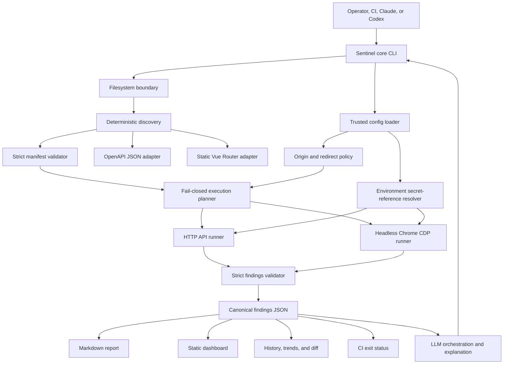

# Sentinel 2.0 Goal-Hardening Design

**Date:** 2026-07-18  
**Status:** Approved for implementation  
**Canonical repository:** `/home/michel/projects/sentinel-sweep`  
**Supersedes:** prompt-only safety and execution behavior in Sentinel 1.8.5

## Product outcome

Sentinel 2.0 will safely discover a supported web application's testable surface,
exercise real API and browser behavior, validate authentication, RBAC, response
schemas, console/network health, and responsive layout, and produce one set of
run-scoped findings that drives every report and CI decision.

The release is successful only when an end-to-end fixture proves that Sentinel:

1. discovers exact Vue routes and OpenAPI operations;
2. performs real HTTP and headless-browser checks;
3. detects deliberate RBAC, schema, console, network, and layout defects;
4. refuses destructive, unknown, or cross-origin actions before execution;
5. keeps secret values out of manifests, findings, reports, logs, and stdout; and
6. emits deterministic, schema-valid artifacts in an isolated run directory.

## Chosen approach

Three approaches were considered in the approved review:

| Approach | Result |
|---|---|
| Patch the agent prose | Rejected: remains nondeterministic and fail-open |
| Restore and extend the 1.8.5 prompt implementation | Rejected: broader surface, but safety and support claims remain unproven |
| Add a deterministic trusted core and retain the LLM for orchestration/explanation | Chosen: enforceable safety with observable end-to-end proof |

The existing Claude plugin package and Codex command surface remain the delivery
shells. Both invoke the same dependency-free Node.js 18+ core. The Python Codex
runner becomes a compatibility shim, not a second implementation.

## Trust model

Sentinel distinguishes four classes of input:

| Input | Trust | Allowed influence |
|---|---|---|
| Bundled defaults and schemas | Trusted release asset | Default limits and data contracts |
| Operator configuration outside the target repository | Trusted only after path, permission, and schema checks | Exact origins, secret references, role mappings, mutation allowlist |
| Target repository and imported API descriptions | Untrusted | Discovery evidence only; never permission to execute |
| Existing manifests, pages, responses, and redirects | Untrusted | Test observations only; revalidated before every use |

Repository text, comments, documentation, source literals, web page content, and
response bodies are always data. The deterministic core never evaluates target code,
loads target modules, follows repository instructions, or invokes repository-local
executables.

## Architecture

The core uses only Node.js standard-library APIs. HTTP uses built-in `fetch` with
manual redirect handling. Browser checks use the Chrome DevTools Protocol against a
trusted operator-selected Chrome/Chromium executable; no target-local browser binary
or package is resolved.

## Component boundaries

### CLI and run lifecycle

`runtime/cli.mjs` owns argument parsing and command exit codes. It delegates all
logic to focused modules and never reads target content itself. A sweep creates one
directory named with a UTC run identifier and writes artifacts atomically with mode
`0600`. Concurrent runs never share mutable files. The `latest` symlink is replaced
only after a complete report has been committed.

Supported 2.0 commands are `setup`, `manifest`, `api`, `browser`, `sweep`, `report`,
`trends`, `diff`, `export`, `dashboard`, and `clean`. The unsafe source-editing
`fix` command and direct GitHub mutation are not core 2.0 claims. Sentinel can emit a
PR-ready Markdown artifact, but publishing it remains an explicit host action.

### Filesystem boundary

The core pins the target root by canonical path, rejects a symlink target root, and
rejects symlinked inputs. Reads are allowlisted by adapter and must remain beneath
the pinned root. Outputs must remain beneath the run root. Temporary files are
created exclusively with no-follow flags, flushed, and renamed atomically.

Sentinel never reads `.env`, `.env.local`, seed data, SSH configuration, cloud
configuration, or arbitrary documentation to discover credentials. The OpenAPI and
Vue adapters read only their declared candidate files.

### Origin policy

Execution requires an exact `http` or `https` origin from trusted operator
configuration. URLs containing user information, query strings in the configured
base, fragments, non-HTTP schemes, or undeclared hosts/ports are rejected. Every
request path must be relative. Redirects are followed manually only while the exact
origin remains approved; cross-origin redirects are recorded and blocked before a
credential-bearing request is made.

Loopback is safer but not implicitly approved: the operator still approves the exact
scheme, host, and port. Non-loopback origins additionally require
`allowNonLoopback: true` in trusted configuration.

### Secrets and authentication

Manifest and settings contracts persist references such as
`env:SENTINEL_ADMIN_TOKEN`, never values. Only environment-variable references are
supported in 2.0. During command initialization, the core resolves currently
available configured secrets to build its redactor. At execution, each selected API
or browser engine synchronously captures only the planned-role credentials before
that engine begins application I/O; capture is limited to credentials required by the
selected plan, and does not resolve a token separately for every request. Values stay
inside core memory and are never returned by public APIs, serialized, logged,
interpolated into errors, or included in
subprocess arguments. Chrome receives a fixed minimal environment with run-scoped
`HOME`, `XDG_CONFIG_HOME`, and `TMPDIR` directories (`XDG_CACHE_HOME` is isolated as
well), so bearer-token environment variables are not inherited by the browser
process.

The supported vertical-slice authentication method is bearer-token authentication.
Each configured role has a token reference. API and browser checks exercise
unauthenticated, lower-privilege, and authorized cases according to an explicit
trusted role mapping. Unknown authorization is a coverage gap and is not guessed.

### Discovery and coverage

The deterministic 2.0 support matrix is intentionally narrow:

| Surface | Supported input | Coverage claim |
|---|---|---|
| Backend | OpenAPI 3.0 or 3.1 JSON with literal paths and local component references | Complete for imported operations and supported schema keywords |
| Frontend | Vue Router static literal route arrays, including nested children, aliases, absolute children, and parameters | Complete only when the adapter encounters no dynamic expressions |
| Authentication | Trusted bearer-token role mapping | Complete for mapped operations and routes |
| Browser | Chrome or Chromium exposing CDP | Complete for the documented navigation, console, network, overflow, empty-content, and screenshot checks |

Every adapter emits `complete`, `partial`, or `unsupported` plus diagnostics and
provenance. A detected but unsupported framework is never represented as zero routes
or zero defects. LLM-assisted enrichment may be displayed separately, but it cannot
upgrade deterministic coverage or authorize execution.

Manifest records use stable identities derived from canonical method/path or route
path. Operations separately model request body, response schemas, parameters,
authorization, target model, delete mode, side-effect classification, mutation
state, computed risk, and provenance. Unknown values are explicit `unknown` states or
`null`; Sentinel never invents a default role hierarchy.

### Merge and overrides

Generated manifests are immutable evidence. Trusted operator overrides are stored in
the external configuration and applied by stable identity after schema validation.
They may add role mappings, parameter examples, or mutation approval, but they do
not overwrite provenance or lower computed risk. Routes merge by canonical path;
operations merge by method and canonical path; schemas use qualified component IDs.
Duplicate or conflicting entries fail validation instead of executing twice.

### Execution policy

`GET`, `HEAD`, and `OPTIONS` operations may execute only when origin, parameters,
authentication state, and response expectations are valid. Every other method is a
mutation and is blocked by default, regardless of a source-provided risk label.

A mutation may execute only when all conditions hold:

1. trusted configuration sets `allowMutations: true`;
2. its stable operation ID appears in `mutationAllowlist`;
3. its side effects and rollback instructions are known;
4. `targetEnvironment` is `development` or `test`;
5. the exact origin is approved; and
6. the invocation includes the explicit sandbox acknowledgement.

Source metadata can increase risk but can never grant approval or reduce it. Unknown
side effects are blocked. Skips are first-class policy decisions in the report.

### API runner

The API runner executes each eligible operation for the expected role set and for an
unauthenticated client. It validates status/RBAC behavior, content type, timeout,
JSON decoding, and the supported JSON Schema subset. Path/query/header examples must
come from trusted configuration or the imported API contract; missing required data
causes an explicit skip.

It uses manual redirects, an abort timeout, bounded response capture, and secret
redaction. It never constructs mutation bodies from response models.

### Browser runner

The browser runner launches only the configured or allowlisted system Chrome binary
with a fresh profile beneath the run directory. It controls tabs through CDP. For
each eligible route, role, and configured viewport it checks the document response,
failed network requests, console errors, uncaught exceptions, horizontal overflow,
configured empty-container selectors, and screenshot capture on error.

Bearer credentials are installed as transport headers inside the core. Redirects and
all credential-bearing requests remain bound to the approved origin. Page text and
scripts never become instructions to the host LLM.

### Findings and reports

API and browser observations normalize into one strict findings document. Stable
finding IDs de-duplicate identical observations while preserving the highest
severity and all provenance. Secret redaction is applied before schema validation
and again before persistence.

The canonical JSON drives Markdown, a self-contained HTML dashboard, history,
trends, diff, export, PR-ready Markdown, terminal output, and CI exit codes. No
consumer recomputes counts independently. Exit code `0` means no critical/error
findings, `1` means runtime/configuration failure, and `2` means a completed sweep
with critical/error findings.

## Error behavior

- Invalid trusted configuration, manifest, or findings: stop before execution.
- Unsupported or partial discovery: continue only with proven entries and report the
  gap; fail CI when `requireCompleteCoverage` is true.
- Missing secret reference: skip the affected role, record a configuration error,
  and never echo the reference's value.
- Unapproved origin or cross-origin redirect: block the request and record a
  security finding.
- Missing Chrome: `browser` and `sweep` fail readiness; `api` remains available.
- Browser/API timeout: abort the individual check, record a finding, then continue
  sequentially within that engine.
- Artifact write failure: fail the run and do not update `latest` or history.

## Verification design

Unit tests use `node:test` and cover filesystem boundaries, URL normalization,
redirects, secret redaction, schema validation, stable IDs, deterministic merge,
risk decisions, OpenAPI parsing, Vue parsing, API response validation, CDP framing,
finding normalization, and report rendering.

Adversarial fixtures include symlink escape attempts, absolute and scheme-relative
paths, malicious comments and documentation, committed manifest overrides, secret
values, cross-origin redirects, dynamic Vue routes, unknown mutation side effects,
and duplicate operations.

The end-to-end fixture is a real Node HTTP application with:

- a Vue Router literal configuration;
- an OpenAPI JSON contract;
- public, user, and admin read endpoints;
- a schema-drift response;
- a cross-origin redirect;
- POST and DELETE handlers whose counters prove they were not called;
- pages with a console exception, failed network request, empty content, and
  responsive overflow; and
- bearer tokens supplied only through environment references.

The release gate starts that app, runs the packaged CLI and a real headless Chrome,
then asserts exact discovery, RBAC and schema findings, browser defects, blocked
redirects, zero mutation counters, valid/redacted artifacts, deterministic reruns,
and consistent JSON/Markdown/HTML/history/CI counts.

## Packaging and compatibility

Version 2.0.0 is a breaking release because manifests, trusted settings, commands,
and safety defaults change. Root plugin assets remain the canonical source and the
`plugins/sentinel` tree remains a byte-for-byte installable mirror. Runtime modules,
schemas, defaults, and documentation are included in mirror parity tests.

Claude and Codex surfaces call the same core CLI. Legacy 1.x manifests are rejected
with a migration message rather than silently accepted. The README and release notes
list only the deterministic support matrix above; broader framework knowledge in
legacy prompts is described as unverified enrichment, not supported execution.

## Release acceptance gates

The release may be tagged only after all of the following pass:

1. existing compatibility tests plus new unit, contract, adversarial, and E2E tests;
2. Node 18 syntax/runtime verification and zero runtime dependencies;
3. strict JSON validation and plugin mirror parity;
4. Claude plugin validation and Codex compatibility installation smoke tests;
5. real API and Chrome sweep of the fixture with expected findings;
6. secret scan showing no fixture token in any artifact or captured output;
7. repeated-discovery semantic equality;
8. mutation counters remaining zero and cross-origin receiver receiving no auth;
9. clean Git diff, version consistency, changelog, security docs, and release notes;
10. exact-commit CI success after push before the GitHub release is published.
